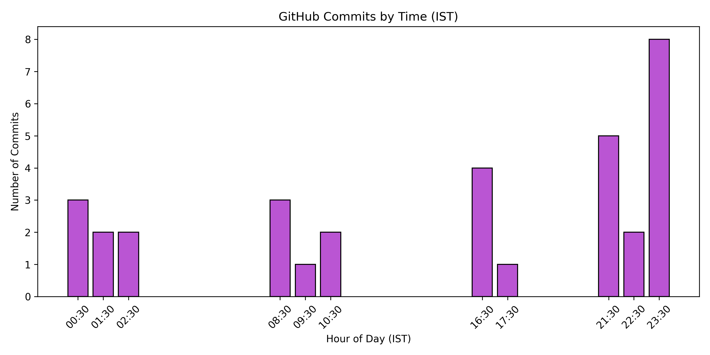

<h1 align="center">🚀 Hey there, I'm <a href="https://www.linkedin.com/in/ashish-raj-070486248/" target="_blank">ASHISH RAJ</a> 🚀</h1>
<h3 align="center">Aspiring Data Scientist | Turning Data into Insights | Passionate about AI & Analytics</h3>

  

---

## 🌟 About Me  
🔭 Currently working on **Machine Learning, Data Analytics, and Data Visualization projects**  
🌱 Learning **Data Science | Machine Learning | Statistics | Tableau | Power BI | DSA**  
💡 Focused on: **Python | SQL | Pandas | NumPy | Statistics | Scikit-Learn | Django**  
👯 Looking to **collaborate on Open Source Data Science Projects**  
📫 Reach me at **ashish1195.raj@gmail.com**  
⚡ Fun Fact: *I see patterns in chaos and turn data into predictions!* 🤖📊  

---

## 🌐 Connect with Me  

  
  
  

---

## 🛠️ Tech Stack & Tools  

**💻 Programming & Data Science**  
  
  
  
  
  

**📊 Data Visualization**  
  
  

**🌐 Web Technologies**  
  
  
  
  

---

## 📊 GitHub Stats  

  
  

<!--  -->
<!--  -->

    

---

## 🔥 Fun Quote  
<h3 align="center">💡 “Data is the new oil, and I’m learning how to refine it.” 💡</h3>
